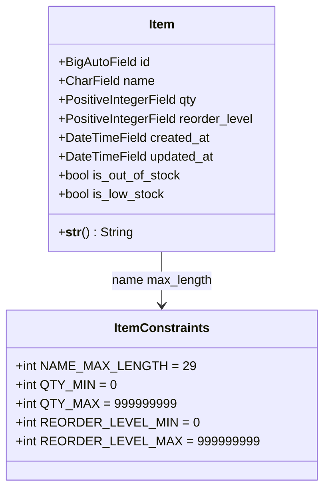
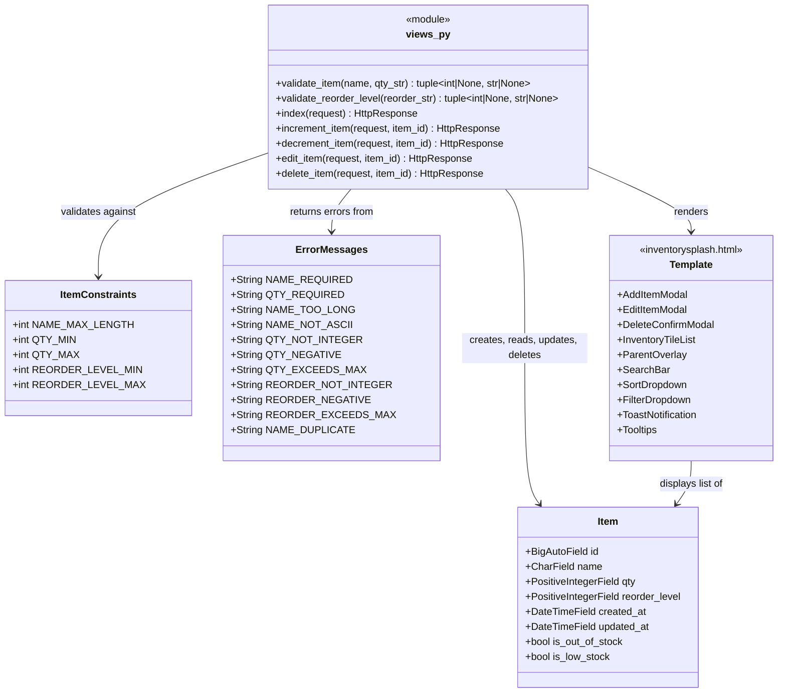
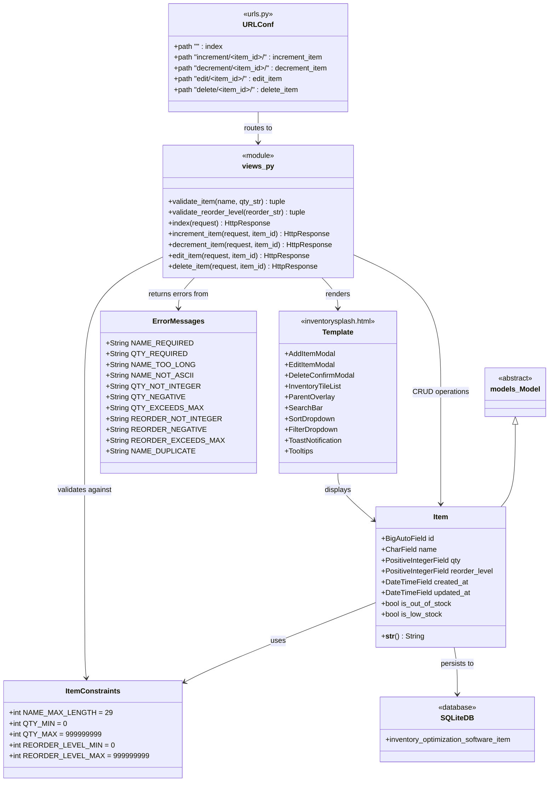

# UML Class Diagrams

## Domain Model

Shows the data model and its constraints. `Item` is the only database entity. `ItemConstraints` defines the validation boundaries that `Item` fields must satisfy.

## Views / Controller Layer

Shows how the view functions handle HTTP requests. `views.py` contains module-level functions (not a class) that perform CRUD operations on `Item`, validate input using `ItemConstraints` and `ErrorMessages`, and render the template.

## Full System Architecture

Shows how all components connect end-to-end. The browser sends requests to Django's URL router, which dispatches to view functions. Views interact with the `Item` model (persisted in SQLite) and render the HTML template back to the browser.

## Test Coverage

Shows all test classes, which inherit from Django's `TestCase`. Dashed arrows show what each test class exercises. 58 tests total across 9 test classes.

```mermaid
classDiagram
    class TestCase {
        <<abstract>>
    }

    class ValidateItemTest {
        +test_valid_input()
        +test_qty_zero()
        +test_qty_max_boundary()
        +test_name_exactly_max_length()
        +test_name_single_char()
        +test_empty_name()
        +test_name_too_long()
        +test_name_non_ascii()
        +test_empty_qty()
        +test_qty_negative()
        +test_qty_exceeds_max()
        +test_qty_decimal()
        +test_qty_non_numeric()
    }

    class ValidateReorderLevelTest {
        +test_valid_reorder_level()
        +test_empty_reorder_level_defaults_to_zero()
        +test_reorder_level_zero()
        +test_reorder_level_max()
        +test_reorder_level_negative()
        +test_reorder_level_exceeds_max()
        +test_reorder_level_non_integer()
        +test_reorder_level_decimal()
    }

    class IncrementDecrementTest {
        +test_increment()
        +test_decrement()
        +test_decrement_at_zero_stays_zero()
        +test_increment_at_max_stays_at_max()
        +test_increment_nonexistent_item()
        +test_decrement_nonexistent_item()
        +test_get_request_does_not_modify()
    }

    class EditItemTest {
        +test_edit_name_and_qty()
        +test_edit_reorder_level()
        +test_edit_duplicate_name_rejected()
        +test_edit_same_name_allowed()
        +test_edit_invalid_qty_rejected()
        +test_edit_nonexistent_item_returns_404()
        +test_edit_updates_timestamp()
    }

    class DeleteItemTest {
        +test_delete_item()
        +test_delete_nonexistent_item()
        +test_id_not_reused_after_delete()
        +test_get_request_does_not_delete()
    }

    class LowStockDetectionTest {
        +test_low_stock_when_qty_equals_reorder_level()
        +test_low_stock_when_qty_below_reorder_level()
        +test_not_low_stock_when_qty_above_reorder_level()
        +test_default_reorder_level_zero_not_low_stock()
        +test_qty_zero_is_out_of_stock_not_low_stock()
    }

    class SearchFilterSortTest {
        +test_search_by_name()
        +test_search_case_insensitive()
        +test_search_no_results()
        +test_sort_name_asc()
        +test_sort_name_desc()
        +test_sort_qty_asc()
        +test_sort_qty_desc()
        +test_filter_low_stock()
        +test_search_and_sort_combined()
    }

    class StockUpdateValidationTest {
        +test_cannot_create_item_with_negative_qty()
        +test_decrement_does_not_go_below_zero()
        +test_edit_cannot_set_negative_qty()
    }

    class TimestampTest {
        +test_created_at_set_on_creation()
        +test_updated_at_changes_on_edit()
    }

    TestCase <|-- ValidateItemTest
    TestCase <|-- ValidateReorderLevelTest
    TestCase <|-- IncrementDecrementTest
    TestCase <|-- EditItemTest
    TestCase <|-- DeleteItemTest
    TestCase <|-- LowStockDetectionTest
    TestCase <|-- SearchFilterSortTest
    TestCase <|-- StockUpdateValidationTest
    TestCase <|-- TimestampTest

    ValidateItemTest ..> views_py : tests validate_item
    ValidateReorderLevelTest ..> views_py : tests validate_reorder_level
    IncrementDecrementTest ..> views_py : tests increment/decrement
    EditItemTest ..> views_py : tests edit_item
    DeleteItemTest ..> views_py : tests delete_item
    LowStockDetectionTest ..> Item : tests is_low_stock, is_out_of_stock
    SearchFilterSortTest ..> views_py : tests index search/filter/sort
    StockUpdateValidationTest ..> views_py : tests qty boundaries
    TimestampTest ..> Item : tests auto timestamps
```

